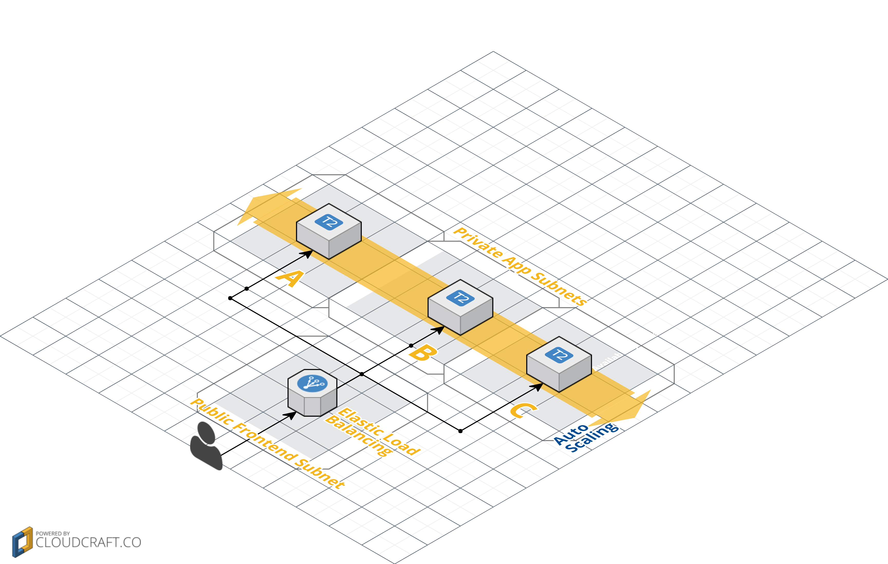

#An example of AWS Infrastructure

###Requirements
Install packer and terraform

```
brew install packer
brew install terraform
brew install awscli
brew install jq
```

Ensure you aws keys are exported as environment variables

```
export AWS_ACCESS_KEY_ID=XXXXXXXXXX
export AWS_SECRET_ACCESS_KEY=XXXXXXX
```

###What are we building?
This VPC will have 2 private subnets across 3 availability zones for application and database servers respectively. These machines will not be reachable outside the VPC.

There is a single public subnet in each availability zone. It is typical that only load balancers exist in this subnet since it is exposed to the internet and our first layer of security for the VPC.

The Security Groups are setup that only 80 and 443 is exposed to the internet and all data must flow through the application layer before reaching the database layer. This ensures that all information must be passed through our applications security before accessing user data.

Lastly this architecture is built for High Availability allowing Autoscaling Groups or instances to be deployed in multiple availability zones and protect against any instability that may occur in a single AWS AZ.



###What does terraform do?
[Terraform](https://terraform.io/) is a Hashicorp product that allows for easy automation of infrastructure. It can also allow for 0 downtime deployments.

In this example we are building an entire VPC with Private and Public subnets and spans 3 availability zones. Terraform creates the following.

* VPC named example
* 3 Private app subnets
* 3 Private db subnets
* 3 Public frontent subnets
* 1 app security group
* 1 db security group
* 1 pub security group
* 1 nat security group
* 1 nat server
* 1 autoscaling group
* 1 elb linked to created autoscaling group
* 1 scale up policy
* 1 scale down policy

We minimize the number or security groups to allow data inside the VPC to flow logically and freely but using the security of VPC to protect our application and database servers from the internet.


###Django Hello World
This application will be run inside an AWS autoscaling group. The Group will be monitored and have health checks for scale up and scale down events. After running the `make build_vpc $AMI_ID` you will be able to view all the resources created by terraform. You will see that Cloud-watch will be inspecting the auto scaling group ensuring we scale if needed.

##Naming conventions
This terraform structure also provides naming conventions that allow users in the AWS console to easily identify resources and provides a standard that makes reports and general use pleasant.


###Running the example code

There are multiple make targets and I will list the suggested order of execution below.

1. `make build_ami` - Uses packer to create a temporary aws instance that is provisioned by ansible. We goal is to save the ami-id and pass it to the next make target.
2. `make plan_vpc $AMI_ID` - Passing the ami-id from step one to this make target, terraform will inform you of everything its going to create. It will be creating the entire VPC for us.
3. `make graph_vpc` - Shows the terraform dependency graph of all the resources being created. Take the output and head over to [graphviz](http://www.webgraphviz.com/).
4. `make build_vpc $AMI_ID` - Will create the vpc with an Djano hello world application running on an autoscaling group. There is also an elb to hit that has all instances in the autoscaling group registered.
5. `make destroy_vpc $AMI_ID` - Will tear down all the infrastructure that terraform has built.

###Running example scripts

1. `make instance_csv` - Prints out all the instance_ids, instance_names, and instances types in an AWS account to a CSV format.
2. `make elb_csv` - Prints out a csv description of all the listeners on ELBs in an aws account.
